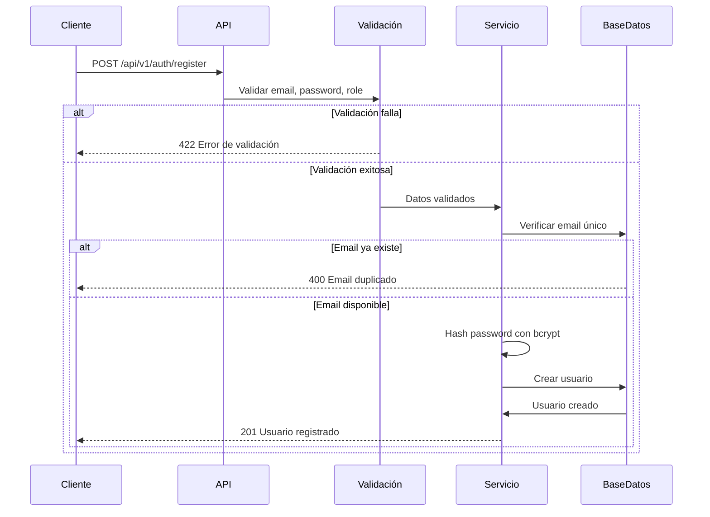

# Registro de Usuarios - Documentación API

## Descripción General

El endpoint de registro permite crear nuevas cuentas de usuario en la plataforma Elenchos. Soporta dos tipos de usuarios: **Alumnos** (STUDENT) y **Profesores** (TEACHER).

## Endpoint

```
POST /api/v1/auth/register
```

## Características de Seguridad

- ✅ Contraseñas hasheadas con **bcrypt**
- ✅ Validación de formato de email
- ✅ Validación de fortaleza de contraseña
- ✅ Prevención de emails duplicados
- ✅ Normalización de emails a minúsculas

---

## Request

### Headers

```
Content-Type: application/json
```

### Body Parameters

| Campo | Tipo | Requerido | Descripción |
|-------|------|-----------|-------------|
| `email` | string | ✅ Sí | Email válido del usuario |
| `password` | string | ✅ Sí | Contraseña (mínimo 8 caracteres) |
| `role` | string | ✅ Sí | Rol del usuario: `"STUDENT"` o `"TEACHER"` |

### Validaciones

#### Email
- Debe ser un email válido con formato `usuario@dominio.com`
- Debe contener `@` y un dominio con punto
- Se normaliza automáticamente a minúsculas
- No puede estar duplicado en el sistema

#### Password
- **Longitud mínima:** 8 caracteres
- **Debe contener:** Al menos una letra (a-z, A-Z)
- **Debe contener:** Al menos un número (0-9)
- Se hashea con bcrypt antes de almacenarse

#### Role
- Valores permitidos: `"STUDENT"` o `"TEACHER"`
- Determina el tipo de cuenta y permisos

---

## Response

### Success Response (201 Created)

#### Para Alumno (STUDENT)

```json
{
  "id": "550e8400-e29b-41d4-a716-446655440000",
  "email": "alumno@example.com",
  "role": "STUDENT",
  "created_at": "2026-02-06T15:30:00.000Z",
  "last_login": null,
  "teacher_id": null,
  "total_problems_solved": 0,
  "average_scaffold_level": 0.0
}
```

#### Para Profesor (TEACHER)

```json
{
  "id": "550e8400-e29b-41d4-a716-446655440001",
  "email": "profesor@example.com",
  "role": "TEACHER",
  "created_at": "2026-02-06T15:30:00.000Z",
  "last_login": null,
  "notion_token": null
}
```

### Error Responses

#### 400 Bad Request - Email Duplicado

```json
{
  "detail": "Email ya está registrado"
}
```

#### 422 Unprocessable Entity - Validación Fallida

**Email inválido:**
```json
{
  "detail": [
    {
      "type": "value_error",
      "loc": ["body", "email"],
      "msg": "value is not a valid email address",
      "input": "email-invalido"
    }
  ]
}
```

**Contraseña muy corta:**
```json
{
  "detail": [
    {
      "type": "value_error",
      "loc": ["body", "password"],
      "msg": "Contraseña debe tener al menos 8 caracteres",
      "input": "abc123"
    }
  ]
}
```

**Contraseña sin letra:**
```json
{
  "detail": [
    {
      "type": "value_error",
      "loc": ["body", "password"],
      "msg": "Contraseña debe contener al menos una letra",
      "input": "12345678"
    }
  ]
}
```

**Contraseña sin número:**
```json
{
  "detail": [
    {
      "type": "value_error",
      "loc": ["body", "password"],
      "msg": "Contraseña debe contener al menos un número",
      "input": "abcdefgh"
    }
  ]
}
```

**Rol inválido:**
```json
{
  "detail": [
    {
      "type": "enum",
      "loc": ["body", "role"],
      "msg": "Input should be 'STUDENT' or 'TEACHER'",
      "input": "ADMIN"
    }
  ]
}
```

---

## Ejemplos de Uso

### Ejemplo 1: Registrar un Alumno

**Request:**

```bash
curl -X POST http://localhost:8000/api/v1/auth/register \
  -H "Content-Type: application/json" \
  -d '{
    "email": "maria.garcia@example.com",
    "password": "MiPassword123",
    "role": "STUDENT"
  }'
```

**Response (201):**

```json
{
  "id": "a1b2c3d4-e5f6-4a5b-8c9d-0e1f2a3b4c5d",
  "email": "maria.garcia@example.com",
  "role": "STUDENT",
  "created_at": "2026-02-06T15:45:30.123Z",
  "last_login": null,
  "teacher_id": null,
  "total_problems_solved": 0,
  "average_scaffold_level": 0.0
}
```

### Ejemplo 2: Registrar un Profesor

**Request:**

```bash
curl -X POST http://localhost:8000/api/v1/auth/register \
  -H "Content-Type: application/json" \
  -d '{
    "email": "prof.rodriguez@university.edu",
    "password": "SecurePass456",
    "role": "TEACHER"
  }'
```

**Response (201):**

```json
{
  "id": "f6e5d4c3-b2a1-4f5e-9d8c-7b6a5e4d3c2b",
  "email": "prof.rodriguez@university.edu",
  "role": "TEACHER",
  "created_at": "2026-02-06T15:50:15.789Z",
  "last_login": null,
  "notion_token": null
}
```

### Ejemplo 3: Error - Email Duplicado

**Request:**

```bash
curl -X POST http://localhost:8000/api/v1/auth/register \
  -H "Content-Type: application/json" \
  -d '{
    "email": "maria.garcia@example.com",
    "password": "OtraPassword789",
    "role": "STUDENT"
  }'
```

**Response (400):**

```json
{
  "detail": "Email ya está registrado"
}
```

### Ejemplo 4: Error - Contraseña Débil

**Request:**

```bash
curl -X POST http://localhost:8000/api/v1/auth/register \
  -H "Content-Type: application/json" \
  -d '{
    "email": "nuevo@example.com",
    "password": "abc",
    "role": "STUDENT"
  }'
```

**Response (422):**

```json
{
  "detail": [
    {
      "type": "value_error",
      "loc": ["body", "password"],
      "msg": "Contraseña debe tener al menos 8 caracteres",
      "input": "abc"
    }
  ]
}
```

---

## Ejemplos con JavaScript/TypeScript

### Usando Fetch API

```javascript
async function registrarUsuario(email, password, role) {
  try {
    const response = await fetch('http://localhost:8000/api/v1/auth/register', {
      method: 'POST',
      headers: {
        'Content-Type': 'application/json',
      },
      body: JSON.stringify({
        email,
        password,
        role
      })
    });

    if (!response.ok) {
      const error = await response.json();
      throw new Error(error.detail);
    }

    const usuario = await response.json();
    console.log('Usuario registrado:', usuario);
    return usuario;
  } catch (error) {
    console.error('Error al registrar:', error.message);
    throw error;
  }
}

// Uso
registrarUsuario('alumno@example.com', 'Password123', 'STUDENT')
  .then(user => console.log('Éxito:', user))
  .catch(err => console.error('Error:', err));
```

### Usando Axios

```javascript
import axios from 'axios';

async function registrarUsuario(email, password, role) {
  try {
    const response = await axios.post('http://localhost:8000/api/v1/auth/register', {
      email,
      password,
      role
    });

    console.log('Usuario registrado:', response.data);
    return response.data;
  } catch (error) {
    if (error.response) {
      // El servidor respondió con un código de error
      console.error('Error del servidor:', error.response.data.detail);
    } else if (error.request) {
      // La petición se hizo pero no hubo respuesta
      console.error('Sin respuesta del servidor');
    } else {
      // Algo pasó al configurar la petición
      console.error('Error:', error.message);
    }
    throw error;
  }
}

// Uso
registrarUsuario('profesor@example.com', 'SecurePass456', 'TEACHER')
  .then(user => console.log('Éxito:', user))
  .catch(err => console.error('Error:', err));
```

---

## Ejemplos con Python

### Usando requests

```python
import requests

def registrar_usuario(email: str, password: str, role: str):
    """
    Registra un nuevo usuario en Elenchos
    
    Args:
        email: Email del usuario
        password: Contraseña (mín 8 chars, con letras y números)
        role: "STUDENT" o "TEACHER"
    
    Returns:
        dict: Datos del usuario creado
    """
    url = "http://localhost:8000/api/v1/auth/register"
    
    payload = {
        "email": email,
        "password": password,
        "role": role
    }
    
    try:
        response = requests.post(url, json=payload)
        response.raise_for_status()  # Lanza excepción si hay error
        
        usuario = response.json()
        print(f"✓ Usuario registrado: {usuario['email']}")
        return usuario
        
    except requests.exceptions.HTTPError as e:
        error_detail = e.response.json().get('detail', 'Error desconocido')
        print(f"✗ Error al registrar: {error_detail}")
        raise
    except requests.exceptions.RequestException as e:
        print(f"✗ Error de conexión: {e}")
        raise

# Uso
if __name__ == "__main__":
    # Registrar alumno
    alumno = registrar_usuario(
        email="juan.perez@example.com",
        password="MiPassword123",
        role="STUDENT"
    )
    
    # Registrar profesor
    profesor = registrar_usuario(
        email="ana.martinez@university.edu",
        password="SecurePass456",
        role="TEACHER"
    )
```

### Usando httpx (async)

```python
import httpx
import asyncio

async def registrar_usuario_async(email: str, password: str, role: str):
    """Versión asíncrona del registro de usuario"""
    url = "http://localhost:8000/api/v1/auth/register"
    
    payload = {
        "email": email,
        "password": password,
        "role": role
    }
    
    async with httpx.AsyncClient() as client:
        try:
            response = await client.post(url, json=payload)
            response.raise_for_status()
            
            usuario = response.json()
            print(f"✓ Usuario registrado: {usuario['email']}")
            return usuario
            
        except httpx.HTTPStatusError as e:
            error_detail = e.response.json().get('detail', 'Error desconocido')
            print(f"✗ Error al registrar: {error_detail}")
            raise

# Uso
async def main():
    usuarios = await asyncio.gather(
        registrar_usuario_async("user1@example.com", "Pass123", "STUDENT"),
        registrar_usuario_async("user2@example.com", "Pass456", "STUDENT"),
        registrar_usuario_async("teacher@example.com", "Pass789", "TEACHER")
    )
    print(f"Registrados {len(usuarios)} usuarios")

asyncio.run(main())
```

---

## Flujo de Registro Completo



---

## Notas Importantes

### Seguridad

1. **Nunca** se retorna la contraseña en la respuesta
2. **Nunca** se retorna el hash de la contraseña en la respuesta
3. Las contraseñas se hashean con bcrypt (factor de costo por defecto)
4. Los emails se normalizan a minúsculas para evitar duplicados

### Diferencias entre Roles

#### STUDENT (Alumno)
- Puede resolver problemas
- Recibe andamiaje socrático
- Tiene árbol de habilidades
- Puede unirse a clases con códigos de invitación
- Campos adicionales: `teacher_id`, `total_problems_solved`, `average_scaffold_level`

#### TEACHER (Profesor)
- Puede crear clases y problemas
- Puede sincronizar contenido desde Notion
- Puede ver progreso de alumnos
- Puede autorizar avances
- Campos adicionales: `notion_token`

### Próximos Pasos

Después del registro, típicamente querrás:

1. **Iniciar sesión** con el endpoint de login (próximamente)
2. **Obtener un token JWT** para autenticación
3. **Usar el token** en requests subsecuentes

---

## Testing

### Probar con Swagger UI

1. Inicia el servidor: `make run`
2. Abre http://localhost:8000/docs
3. Busca el endpoint `POST /api/v1/auth/register`
4. Click en "Try it out"
5. Completa el JSON de ejemplo
6. Click en "Execute"

### Probar con curl

```bash
# Test básico
curl -X POST http://localhost:8000/api/v1/auth/register \
  -H "Content-Type: application/json" \
  -d '{"email":"test@example.com","password":"Test1234","role":"STUDENT"}'

# Test con formato bonito
curl -X POST http://localhost:8000/api/v1/auth/register \
  -H "Content-Type: application/json" \
  -d '{"email":"test@example.com","password":"Test1234","role":"STUDENT"}' \
  | python -m json.tool
```

---

## Troubleshooting

### Error: "Email ya está registrado"
**Causa:** El email ya existe en la base de datos  
**Solución:** Usa un email diferente o elimina el usuario existente

### Error: "Contraseña debe tener al menos 8 caracteres"
**Causa:** La contraseña es muy corta  
**Solución:** Usa una contraseña de al menos 8 caracteres

### Error: "Contraseña debe contener al menos una letra"
**Causa:** La contraseña solo tiene números  
**Solución:** Agrega al menos una letra (a-z, A-Z)

### Error: "Contraseña debe contener al menos un número"
**Causa:** La contraseña solo tiene letras  
**Solución:** Agrega al menos un número (0-9)

### Error: "value is not a valid email address"
**Causa:** El formato del email es inválido  
**Solución:** Usa un email válido con formato `usuario@dominio.com`

### Error de conexión
**Causa:** El servidor no está corriendo  
**Solución:** Inicia el servidor con `make run` o `uvicorn app.main:app --reload`

---

## Soporte

Para más información:
- **Documentación API completa:** http://localhost:8000/docs
- **Documentación alternativa:** http://localhost:8000/redoc
- **Health check:** http://localhost:8000/health
